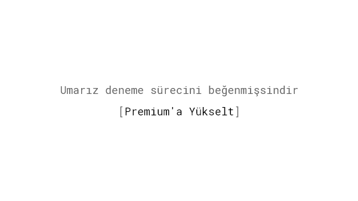
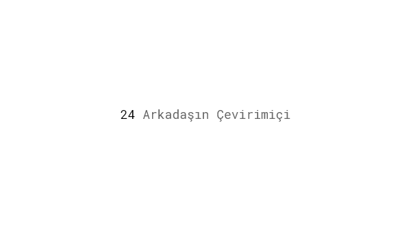
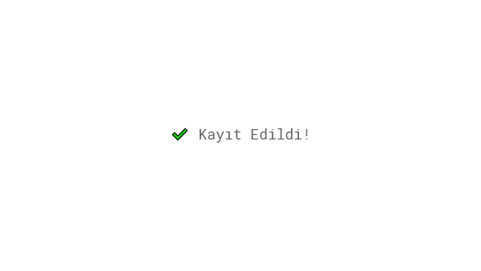

Hayatımızda sürekliliği yakalamak için elimizden gelen her şeyi yaparız. Bir söz verdiğimizde, bu sözü yerine getirmek için kendimizi yükümlü hissederiz. Bir karar verirken veya önümüze birkaç seçenek geldiğinde ise gelecekte yapacağımız tüm seçim ve kararların birbiri ile tutarlı olması için çabalarız. Bu adanmışlığı haklı göstermek için de başkalarının onayını bekler ve bu kararları destekleyen nedenler oluşturmaya çalışırız.

## Araştırmalar

Herkes planlanan maliyetlerin defalarca kez aşıldığı en az bir proje bilir. Hatta bazen, öyle projeler olur ki bu projeler direkt planlı bir şekilde başarısızlığa doğru giden bir yolu takip ediyor gibidir. Bu başarıszlığa giden planlara bağlılık arttıkça daha fazla efor, para ve zaman ayırma eğilimini ifade eder ([Staw, 1976](http://www.sciencedirect.com/science/article/pii/0030507376900052)). Genelleme yapmamız gerekirse; hali hazırda yaptığımız yatırımları (zaman ve diğer kaynaklar) [kaybetmek istemez](/loss-aversion/) ve tutarsız görünmek istemeyiz.

"Ben bu kitabı ne kadar beğenmesem de en azından 100 sayfa okuyacağım." Bu size tanıdık geliyor mu? Tabi ki, siz bu kitaba hem para verdiniz hem de beğenmediğinize karar verirken okudunuz, bunları geri alamayacağınızı bildiğiniz için de daha fazla üstüne gidiyorsunuz. İşte buna *batık maliyet yanılgısı* denir. Daha önce yatırım yapılan kaynakların bir sonucu olarak bir davranışı sürdürmemize yol açar  ([Arkes & Blumer, 1985](http://www.sciencedirect.com/science/article/pii/0749597885900494)).

Ikea etkisi, içine iş koyarsak, şeylere orantısız bir şekilde daha fazla değer verdiğimiz bilişsel bir önyargıdır ([Norton, Mochon, & Ariely, 2012](http://www.hbs.edu/faculty/Pages/item.aspx?num=41121)). Bu fenomenin bir dizi olası açıklaması vardır. Bir görevin başarıyla tamamlanması bize yeterlilik duygusu verir ve bizi olumlu bir ruh haline sokar. Bir başka neden de, bir ürüne harcadığımız çabaları haklı çıkarmayı sevmemiz olabilir, bu yüzden onu daha çok sevme eğilimindeyiz.

İnsanlar mevcut durumu bir referans noktası olarak kullanırlar ve herhangi bir değişikliği bir kayıp olarak algılarlar. Biz alışık olduğumuz şeyleri tercih ediyoruz ve değişime karşı bir direnç gösteriyoruz. Bu fenomone ise *statüko yanılgısı* denir ([Samuelson & Zeckhauser, 1988](https://sites.hks.harvard.edu/fs/rzeckhau/SQBDM.pdf)).

## Örnekler

### Evde Dene Programları

Birçok çevrimiçi gözlük perakendecisi, potansiyel müşterilerinin satın almadan önce denemeleri için birden fazla gözlük almasına izin verir. Bu hizmetin rahatlığı, müşteririnin mükemmel çerçeveleri bulmasını ve çevresinden geri bildirim almasını sağlar. Şirketler satın alma zorunluluğu olmadığını söylüyorlar, ancak bir çift gözlüğü yüzünüze taktığınız an, satın almadan durmanız pek mümkün değil.

### Sosyal Medya Yarışmaları

Potansiyel müşterilerinizi, örneğin belirli bir durumda kendi fotoğraflarını yüklemelerini isteyerek, kendilerini markanızın hayranı olarak tanımlamaya teşvik eden bir yarışma düzenleyin .Birisi halka açık bir taahhütte bulunduğunda, onlara bir şeyler yaptırmak her zaman kolaylaşır. Bir araştırma ne kadar çok halka açık olursa, gelecekteki eylemler üzerindeki etkisi o kadar güçlü olur.
Bir araştırma, kilo vermek istediğini alenen ifade eden kişilerin önemli ölçüde daha başarılı olduğunu göstermektedir ([Nyer & Delande, 2009](http://onlinelibrary.wiley.com/doi/10.1002/mar.20316/abstract)).

### Online Açık Arttırma

Açık artırma siteleri, insanların duygusal düğmelerine basmak için tasarlanmıştır. Daha başlamadan, teklif sahipleri kendilerini kazanan olarak hayal ederler. Potansiyel alıcıların, yalnızca bir öğeyi kazanmak için maksimum tekliflerini rahat oldukları bir değerin üzerine çıkarmaları nadir değildir. Birçoğu bu fenomeni *müzayede ateşi* olarak tanımlar.

### Pop-up'lu Evet/Hayır Soruları

Kabul edelim: Pop-up'lar internetteki en hoş şeyler değil -ama bazı insanlar için çok iyi çalışıyor gibi görünüyorlar. Son yıllarda, bir pop-up göründüğünde ziyaretçilere bir seçenek verildiği bir eğilim var: ya "evet" deyin ve bir bedava almak için ikinci adımda e-posta adresinizi bırakın ya da aptal olun ve "hayır"ı seçin. Bu taktik, yaygın olarak, küçük bir anlaşmanın sonraki, daha büyük taleplerin önünü açtığı, *kapıya ayak basma tekniği* olarak bilinir ([Freedman & Fraser, 1966](https://www.researchgate.net/publication/17217362_Compliance_Without_Pressure_The_Foot-in-the-Door_Technique)).

### İstek listesi

Müşterilere ürünü hemen satın alma veya başka bir zaman satın alma için seçim yapma şansı verin. Amazon gibi e-ticaret siteleri, istek listenize bir şey eklediğinizde, daha sonra satın alma olasılığınızın daha yüksek olacağını bilir çünkü satın alma arzunuzu zaten kabul etmişsinizdir.

### Hassas Bilgileri En Son İstemek

Bir ödeme veya işe alım süreci ayarlarken, kullanıcılarınızdan e-posta adresleri veya kredi kartı bilgileri gibi kişisel bilgilerini en son isteyin. En kolay görevlerden başlayarak, kullanıcı bu sürecin içine iyice dahil olacak ve daha hassas bilgiler söz konusu olduğunda, şimdiye kadarki zamanını yatırdığı için kullanıcının tüm süreci tamamlama olasılığı daha yüksek olacaktır(batık maliyet yanılgısı).

### Çapraz Satış

İnternetten  satın almak için akıllı telefona baktığınızı hatırlıyor musunuz? Mağaza, telefonunuzla birlikte kullanmanız için bir ekran koruyucu veya kılıf önermiş olabilir. İşte bu çapraz satıştır. Bir şey almaya karar verdiğimizde, ilk kararımızı haklı çıkarmak ve onunla tutarlı olmak istediğimizden ek aksesuarlar almaya daha meyilliyizdir. Örneğin Amazon, gelirinin [gelirinin %35'ini](http://www.the-future-of-commerce.com/2013/10/14/ecommerce-cross-sell-up-sell/) çapraz satışa bağlıyor.

### Freemium (Ücretsiz Versiyon) ve Ücretsiz Denemeler

Bağlılık ve tutarlılık ilkelerine başvurmanın bir başka yolu da ücretsiz deneme sürümü veya Dropbox'ın yaptığı gibi ücretsiz bir versiyon sunmaktır: Ücretsiz depolama alanı kalmadığında veya deneme süresi dolduğunda, müşteriler ücretli bir plana yükseltmeye daha meyilli olacaklardır, zaten yeni hizmeti öğrenmeye, kurmaya ve kullanmaya kendini adamıştır.

### Taahhüt Onay Kutusu

Bir ipotek şirketi sadece taahhüt onay kutusu ekleyerek [geri dönüş oranını %11](http://www.conversionvoodoo.com/blog/2010/07/11-conversion-rate-increase-with-a-%E2%80%9Ccommitment-checkbox%E2%80%9D/) arttırdı.

### Ağ Etkisi

Daha fazla sayıda kullanıcı bir ürünün değerini artırdığında, bir  ağ etkisine sahibiz. Skype, İnstagram, Airbnb veya eBay, ağa katılan daha fazla insanla daha iyi hale gelir. Örneğin, WhatsApp gibi bir mesajlaşma uygulamasına bağlı kaldığımızda ve akranlarımızı rehberimize kaydettiğimize, farklı bir şey deneyeceğimiz şüphelidir.

### Kullanıcı Tarafından Oluşturulan İçerik

Bir kullanıcı Dropbox, Twitter veya Evernote gibi bir uygulamayı her bilgiyle beslediğinde, değeri veri biçiminde depolar. Bu yatırımlar ne kadar büyük ve sık olursa, kullanıcının tekrar tekrar gelme olasılığı o kadar artar.

