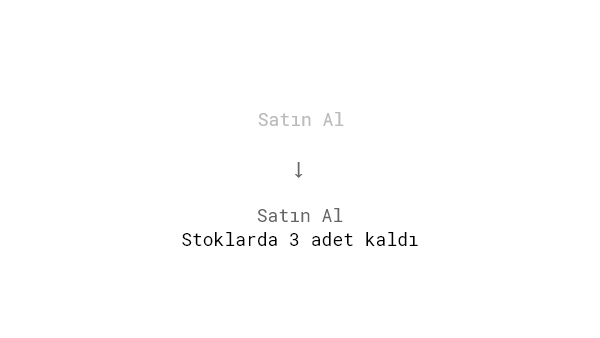
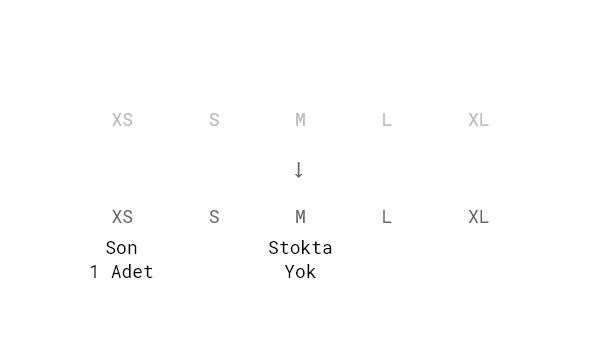
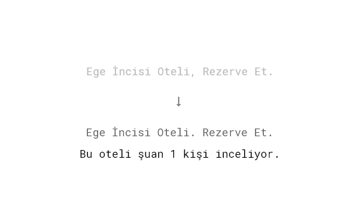
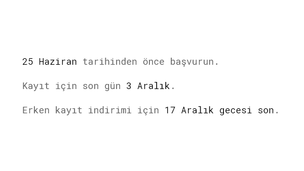
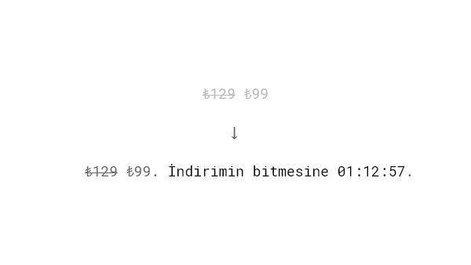
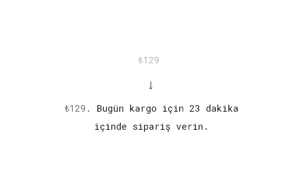
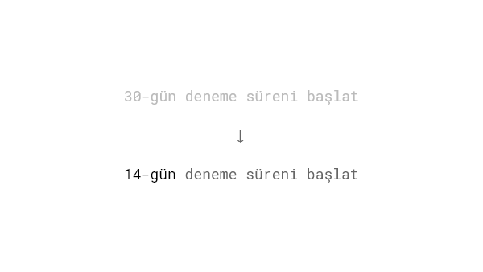
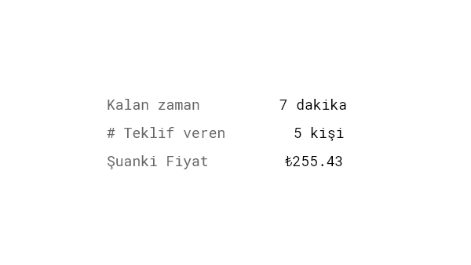
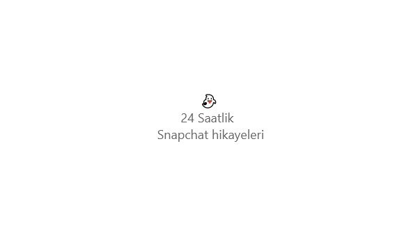

Bir şeye sahip olmamız ne kadar zorsa, onu o derece fazla isteriz. İnsanlar genelde bir şeyin mevcut olma veya erişilebilmesi durumunu bu şeyin kalitesine bağlarlar. [Kayıp kahrı](/kayip-kahri/) konseptinde görülebileceği gibi; bir şeyi kaybetme korkusu, bu şeyi elde etme isteğinden daha fazla motive edicidir.

## Araştırmalar

Kadınlar ilişkisi olan erkekleri yalnız erkeklerden daha çekici bulurlar ([Parker & Burkley, 2009](http://www.sciencedirect.com/science/article/pii/S0022103109001048?via=ihub)). Yani bir şey ulaşılmaz ya da sınırlıysa bize daha çekici hale gelir.

[Worchel, Lee and Adewole (1975)](http://psycnet.apa.org/record/1976-03817-001) tarafından yapılan araştırma insanların kısıtlı bir sayıda olan kurabiyelere daha çok değer verdiğini gösterdi. Bazı katılımcılara bir cam kavanoz içinde on tane kurabiye verilirken bazılarına ise sadece iki tane verildi. Araştırma sonucunda iki adet kurabiye verilenlerin, on adet kurabiye verilenlere göre çok daha yüksek puan verdikleri görüldü.

Az bulunurluk taktikleri, daha eşsiz ihtiyaçları olan müşterilerde daha etkili olabiliyor([Lynn, 1991](http://scholarship.sha.cornell.edu/cgi/viewcontent.cgi?article=1181&context=articles)).

## Örnekler

### Sınırlı Stok

Hemen hemen her e-ticaret sitesi ürünün stoklarda ne kadar az kaldığını gösterir. Yukarıda Worchel ve diğerleri tarafından yapılan kurabiye deneyinde gösterildiği gibi, son zamanlarda bizim için daha az erişilebilir hale gelen şeylere daha fazla değer veriyoruz.

### Belirli Bir Model veya Boyut İçin Sınırlı Stok

Daha da ileri gidin ve belirli bir tür, renk veya boyut veya bunların bir kombinasyonu için kaç öğenin mevcut olduğunu gösterin.

### İnsanlara Diğer Alıcıları Göstermek

İnternetten görüp beğendiğiniz oteli tutmayı düşünürken, bir anda yalnız olmadığınızı ve sizinle birlikte o anda odayla ilgilenen başkaları olduğunu fark edebilirsiniz. O anda kaybetme korkusu tetiklenir. O anda kaç kişinin o ürünle ilgilendiğini göstermek az bulunurluk için güçlü bir taktiktir.

### Son Tarihler

Beklentilerinizi zaman sınırlarına maruz bırakarak şimdi harekete geçmeleri için bir neden verin. Ama dikkatli olun. Ne yazık ki, bazı işletmeler bu tekniği dolandırıcı yollarla kullanmaya başladı ve bu da insanların teklifinizi daha dikkatli değerlendirmelerine neden olabilir.

### Geri Sayım Sayaçları ile Sınırlı Süreli Teklifler

İnsanların bir şeyleri kaçırma korkusundan daha fazla yararlanmak için animasyonlu zamanlayıcıları kullanın. Bu taktik, genellikle, indirimli fiyat veya bazı ek bonus öğeler gibi, hızlı hareket etmek için algılanan bir fayda ile kullanılır.

### Ertesi Gün Nakliye İçin Zaman Kısıtlamaları

Amazon, ertesi gün kargo için satın alma işleminin tamamlanması gereken tam kalan süreyi gösterir. Bir ürüne hemen ihtiyaç duyan müşteriler, ertesi gün ellerine geçmelerini sağlamak için dürtüsel olarak satın alırlar.

### Ücretsiz Deneme Süresinin Kısaltılması

KISSmetrics'in kurucu ortağı Hiten Shah, deneme süresini 30 günden 14 güne indirdiğinde, ürünün kullanımında [%102'lik bir artış gördü](https://www.quicksprout.com/2013/01/14/11-obvious-ab-tests-you-should-try/). İndirim, insanlara hizmeti en kısa sürede kullanmaları gerektiğini hissettirdi.

### Çevrimiçi Açık Artırmalar

Tek birimli bir müzayede, aynı anda birkaç az bulunurluk unsurunu birleştirir: miktar ve zamanla sınırlıdır. Sınırlı bir zaman diliminde birden fazla kişi tek bir ürün için teklif verir ve yalnızca bir kazanan olabilir - işte eBay'i böylesine büyük bir şirket haline getiren de budur.

### Kısıtlama Özellikleri ve İçerik Kullanılabilirliği

Günümüzün çevrimiçi dünyasında, her şey kalıcı olarak bolca mevcut gibi görünüyor. Snapchat, eğlence sektörüne az bulunurluğu yeniden tanıttı. Sadece 24 saat kullanılabilen Snapchat'te bir hikayeyi kaçırırsanız, bir daha asla göremezsiniz. Bu özellik, kesinlikle uygulamayı bu kadar yapışkan yapan ve kullanıcıları geri gelmeye ikna eden bir parçasıdır. Ürününüzde yapay olarak az bulunur yapılabilecek bir şey var mı?

