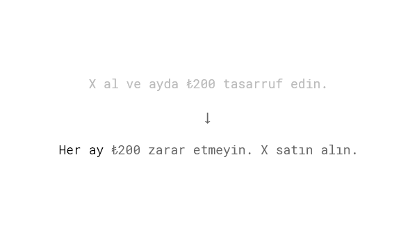
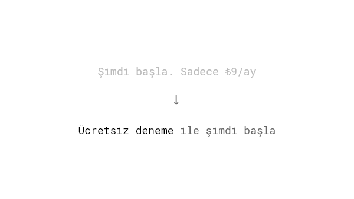
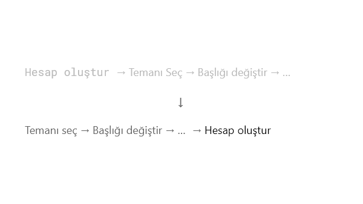
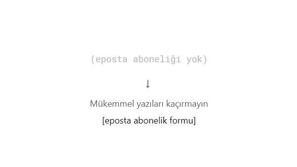
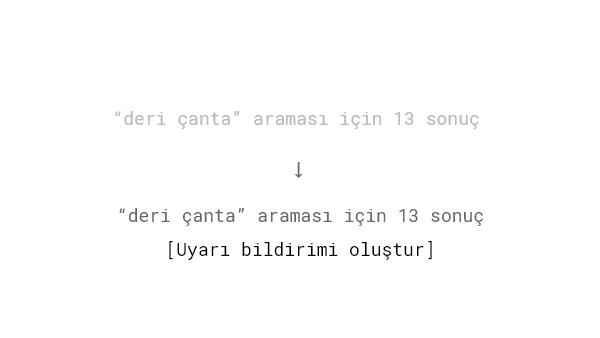
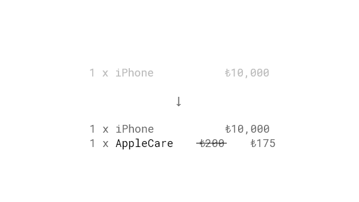
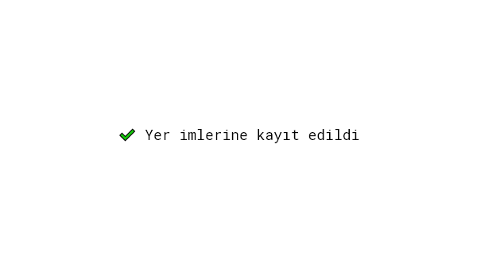
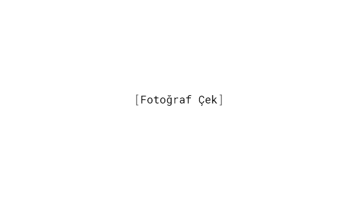
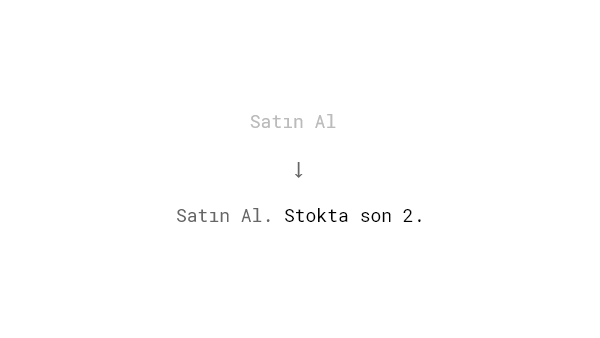

İnsanlar eşit değerdeki kayıplarını, kazançlarından daha etkili şekilde hissederler. Atasözünün tam tersine, kaybettiği eşşeğin kahrını çeken birisi, eşşeğini bulduğunda başlangıç noktasının askine aynı tatmini hissetmeyecektir.

Patronununuzun IK müdürü ile size aylık 200 TL zam yapacağını duyduğunuzu farz edelim. Maaşınızdaki bu artış konusunda nasıl hissederdiniz? Peki başka bir senaryoda patronunuzun maaşınızdan aynı miktarda kesinti yapacağını duyarsanız nasıl hissedersiniz?

## Studies

Losses have less of an impact than predicted. We tend to overestimate and dwell on negative experiences. Therefore, loss aversion is more a property of forecasts than a characteristic of an actual experience ([Kermer, Driver-Linn, Wilson & Gilbert, 2006](http://journals.sagepub.com/doi/abs/10.1111/j.1467-9280.2006.01760.x)).

Investors tend to be more prone to *myopic loss aversion* (MLA), a concept that is a combination of a high sensitivity to losses and a tendency to check their wealth too frequently ([Haigh & List, 2005](http://onlinelibrary.wiley.com/doi/10.1111/j.1540-6261.2005.00737.x/full)). This bias leads to a short-term view that causes irrational decisions.

## Examples

### Focusing on the loss in offers
Talk about what your potential customer will lose if they don’t purchase, rather than what they would gain by buying. We tend to give losses twice as much psychological weight as we do gains ([Tversky & Kahneman, 1992](http://cemi.ehess.fr/docannexe/file/2780/tversjy_kahneman_advances.pdf)).

### Negative headlines
The same principle can also be applied to headlines of landing pages or blog posts. We don’t want to lose anything we value. Perform split tests to see which type of headline works best for your audience.

### Free trials
Loss aversion is one of the reasons why free trials work so well for SaaS businesses. When, for example, a 30-day trial period ends, giving up premium features or the complete service feels like losing.

### Lazy registration
Let your customers enter data into your service before even signing up, so that they get to play with the app and invest time. To be able to save their work, they have to register an account. This step is then smaller than losing what they have already built.

### Newsletters
You don't want to miss out on a great deal, right? What about posts from your favorite blogger? Provide exceptional value to your audience, and they will fear that they will miss out on something.

### Providing a subscription feature
Do you manage a SaaS business, an online marketplace, or a community platform? Let your users subscribe to get notified when a long-running task is finished, a price has dropped, or someone has posted something new. Find out what information your users could miss out on and add the ability to create an [external trigger](/triggers/) for it.

### Pre-filling the shopping cart
Preload the shopping cart with discounted upsells. Users will hesitate to remove them from the cart as they have already "got" them. If they don't buy the upsells at the discounted price now, they feel they're likely to miss out on saving money. This tactic may be considered as a dark pattern. Users can overlook the additional items and buy them without knowing it.

### Bookmarks
We found an excellent source of information, but we don’t have time to delve into it now, so we bookmark it for later. Bookmarking services, but also sites like Pinterest, are based on the fear of missing out on some good content.

### Selfies and food pics
Everyone has that one friend who takes pictures of anything and everything. Usually, that's not all. Based on a thorough selection process, the "winning" photo has the honor of getting published on various social media platforms. The fear of losing a moment is one of the drives behind this phenomenon of constantly taking pictures.

### Scarcity
As things become less available, they become more desirable. The fear of losing out on something can be a huge motivator. Sometimes, the buzz created by scarcity is sufficient to create a rush of panic buying. Because it's such a powerful tool, I've dedicated a whole post to the [principle of scarcity](/scarcity/).

