Tetikleyiciler, bizi bir şeyi tamamlamaya iten herhangi bir şey olabilir. Tetikleyiciler bize sonraki adımımızı söyleyen, ilk bakışta fark edilmesi güç içten veya dıştan gelen dürtülerdir.

Dıştan gelen tetikleyicilerin her tarafta olduğunu söyleyebiliriz. Bu tetikleyiciler algılarımızı kullanarak bize belirli bir aksiyonu tamamlamamız için hatırlamalar yapar. Bunlar bir web sayfasında "buraya tıkla" gibi bir buton halinde olabilirken, yürüdüğünüz sokaktaki buram buram konan taze kahve ve kek kokusu halinde olabilir.

Diğer yandan, içten gelen tetikleyiciler ise içimizde oluşan dürtüler olarak özetlenebilir. Hatıralar, duygular veya içinde buluduğumuz durumun içselleştirilmesi ile oluşabilecek dürtüler, örnek olarak bazı insanlar içinde bulundukları durumu unutma kaygısıyla telefonu ile fotoğraf çekip Instagram'a yükler. İçten gelen tetikleyiciler, alışkanlık oluşturmanın önemli olduğu ürünlerin başarısında büyük bir öneme sahiptir.

## Araştırmalar

Ivan Pavlov, köpeklerin bir zil sesiyle salya akıtılması için şartlandırılabileceğini gösterdi ([Pavlov, 1927](http://psychclassics.yorku.ca/Pavlov/)). Köpekleri beslemeden önce zil çalarak bu şekilde tepki vermeleri için eğitti. Bu öğrenme prosedürü *klasik koşullandırma* olarak bilinmeye başladı.

BJ Fogg'un davranış modeline göre, istenen davranışın gerçekleşmesi için üç unsur mevcut olmalıdır: motivasyon, yetenek ve tetikleyici. Diğer bir deyişle, değer katmalı, tamamlaması basit olmalı ve dikkat çekmelidir. Bunlardan bir veya daha fazlası eksikse, istenen eylem gerçekleşmeyecektir ([Fogg, 2009](http://dl.acm.org/citation.cfm?doid=1541948.1541999)).

## Örnekler

### Harekete Geçirici Mesajlar (Call-to-action)

Harekete geçirici mesajlar, kullanıcılarınıza rehberlik eden ve ne yapacaklarını söyleyen bir buton, grafik veya metin biçiminden oluşabilecek bir dış tetikleyicidir. Bu mesajların stilleri, renk, konum veya boyutlarındaki en küçük değişiklikler bile dönüşüm oranında büyük artışlara yol açabilir: Örneğin Black and Decker, "Alışveriş Yap" yerine "Şimdi satın al" butonu kullanarak [tıklama oranında %17 artış](https://blog.optimizely.com/2014/07/03/black-decker-discovers-big-win-in-buy-now-vs-shop-now-test/) elde etti. Bir butondaki bir-iki kelimenin bile temel ölçütler üzerinde büyük bir etkisi olabiliyor.

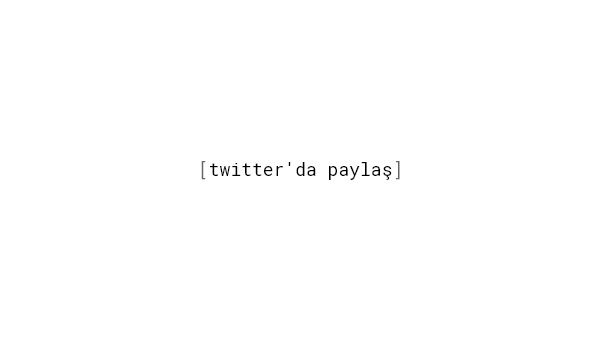

### Ana Ekrandaki Uygulama Simgeleri

Bizler [bir günde telefonumuza 2,167 kere dokunuyoruz ve
76 kere ekran kilidimizi açıyoruz](https://blog.dscout.com/mobile-touches). Her uygulamalar sekmesine baktığımızda potansiyel tetikleyicilerle karşı karşıya kalıyoruz. Uygulamaların üzerindeki kırmızı bildirimler sanki bir şeyler kaçırıyorum hissini (FOMO) arttırıyor. Mobil kullanıcılarınıza, web sitenizi [uygulama gibi ](https://developers.google.com/web/fundamentals/engage-and-retain/app-install-banners/) ana ekranlarına yükleyebileceğini ve bu şekilde sanki normal bir uygulamaymışçasına tam ekran modunda kullanabileceklerini hatırlatın.

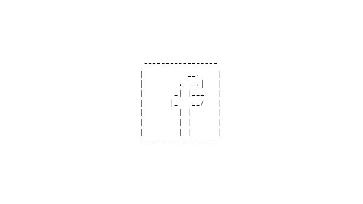

### Push Bildirimleri

Localytics'e göre, mobil kullanıcıların [52%](http://info.localytics.com/blog/52-percent-of-users-enable-push-messaging)'sinin telefonlarında push bildirimlerini aktif. Eğer ki push bildirimleri gerektiği gibi kullanırsa bu sayının [80%](https://www.thanx.com/push-notifications-vs-email-whats-better-for-reaching-customers/)'e kadar çıkabileceği söyleniyor. Yani bu bildirimler insanlara bir şeyler yaptırmak için etkili dış tetikleyicilerdir. Kaliteli push bildirimleri; iyi zamanlanmış, verdiği mesajı açık ve merak uyandırıcı olmalıdır.

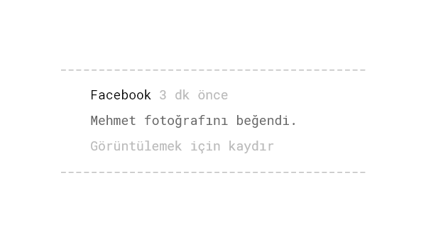

### Yazılım Güncellemeleri

Daha önce hiç telefona yüklediğinizi bile unuttuğunuz uygulamaların güncellenmesi gerektiği ile ilgili hatırlatma aldınız mı? Güncellemeler pazarlama ve hali hazırda olan kullanıcıların geri dönmesi için taktiksel olarak da kullanılabilir. İos ve Android gibi mobil işletim sistemlerinde yerleşik olarak güncelleme bildirimleri olur. Aynı zamanda masaüstü ya da web tabanlı platformlar için de, güncellemeler için e-postalar atıp kullanıcıları yeni özellikleriniz için bilgilendirebilir ve aynı zamanda kendinizi hatırlatabilirsiniz.

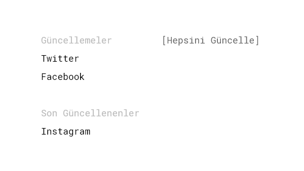

### Tarayıcı Uzantılarının Simgeleri

Tarayıcınızdaki menü çubuğuna bakın. Kaç tane üçünçü taraf eklenti görüyorsunuz? Her tarayıcınızı açtığınız zaman, bilinçli ya da bilinçsiz olarak o dikkat çekici parlak simgeleri fark edersiniz. Pinterest, Buffer ya da Pocket gibi birçok şirket için tarayıcı uzantıları kendi sorumsuz  iş akışları için önemlidir.

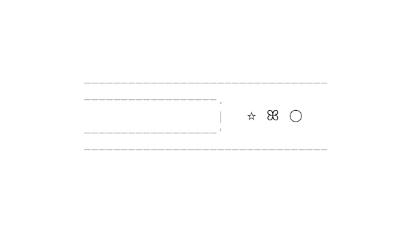

### İçerikleri Diğer Web Sitelerine Entegre Etmek

Tarayıcı eklentileri o an kullandığınız ekranı kendisine göre  değiştirebilir. Örneğin; Buffer eklentisini kullanırken Twitter'da gezerseniz  "Buffer" kendisi için çeşitli yerlere kendi butonunu koyacaktır. Bir sosyal yer imi hizmeti sağlayan Refind, Google'da gezerken kaydettiğiniz  bağlantıları vurgular ve saklar böylece ihtiyacınız olduğu zaman okuyabilirsiniz. Pinterest eklentisi ise imlecinizi üstüne getirdiğini resmin üzerine "Kaydet" ve "Benzerlerini keşfet" butonlarını ekler.

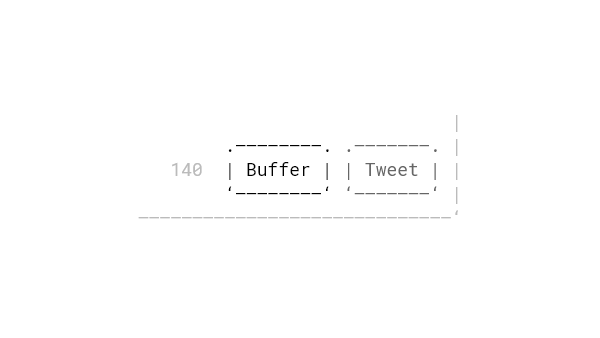

### Okunmamış Bildirim Sayısı

İki tip insan vardır: yüzlerce okunmamış bildirimi olanlar ve bir tane bile okunmamış bildirimi olsa bile ona bakana kadar rahatlayamayanlar.**Notification badges are an easy way to indicate if there have been new activities or actions requiring our interest**. Bu bildirim sayacları genellikle uygulama simgelerinin üstlerinde, web uygulamalarının menü çubuklarında ya da HTML belge başlığı tarayıcılığıyla oluşturulan belge başlığı şeklinde olabilir. Aynı zamanda [faviconunuz'da bildirim sayacı](http://lab.ejci.net/favico.js/) göstermeniz de mümkündür.

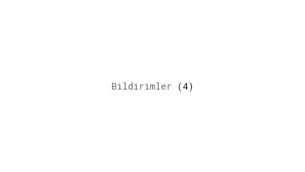

### İşlem E-postaları

Bir uygulamaya kaydoldunuz ve gelen kutunuza hoş bir hoş geldin mesajı alırsınız işte buna "işlem e-postası" denir. Kullanıcıların etkileşimi ya da zamana dayalı koşul bu tür bildirimleri tetikler. IBM'nin yürüttüğü bir e-posta pazarlaması araştırmasına göre; işlem e-postalarının, pazarlama e-postalarına göre [%116 daha fazla açılma oranı](https://www-01.ibm.com/marketing/iwm/dre/signup?source=urx-13772&S_PKG=ov56286) varmış çünkü işlem e-postaları kişiselleştirilmiştir ayrıca alıştığımız için bu e-postaların gelmesini de bekleriz. İşlem e-postaları genellikle hoş geldiniz, parola sıfırlama, sipariş onaylama, bildirimler ya da önemli olayları haber veren maillerdir.

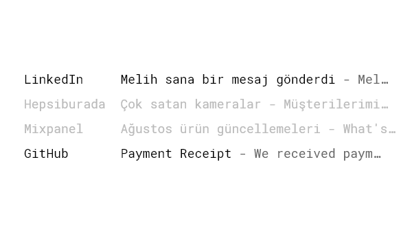

### Pazarlama E-postaları

Toplu, promosyon, ticari, yayın gördüğünüz gibi pazarlama e-postalarının birçok ismi var. İşlem e-postalarından farklı olarak tek bir kişidense toplu olarak ama aynı içerikle gönderilir. Başındaki ufak bir selamlamada kullanıcı adı ya da gönderilen kişinin adının yazması onu özel bir e-posta yapmaz. Örnek olarak; ürün güncellemeleri, web sitesi lansmanları, etkinlik davetleri, özel teklifler ve çekilişler gösterilebilir. Müşterilerinize ulaşabilmek ile spam olarak etiketlenmek arasında ince bir çizgi var. Sadece size izin veren kullanıcılara gönderin, aşırıya kaçmayın, ama abonelerinizle iletişime geçmek için çok da fazla beklemenize gerek yok. Üzerinden zaman geçmiş e-posta listeleri yüksek oranda abone kaybetmenize neden olabilir.

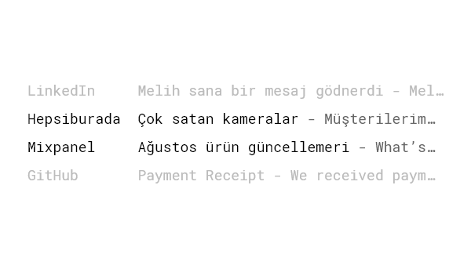

###  Yer İmi Eklenmiş Siteler

Bizler insan olarak [sahip olduğumuz şeyleri kaybetme korkusu](/loss-aversion/)'na sahibiz. Bu yüzden ilg çekici  siteleri yer imlerine ekliyoruz hatta bazılarımız hiç bakmasa bile bunları yarınlar yokmuşçasına biriktirir. Arada bir yer imleri klasörüne bakmaya cesaret ettiğimizde kocaman bir potansiyel tetikleyici listesine mağruz kalırız.

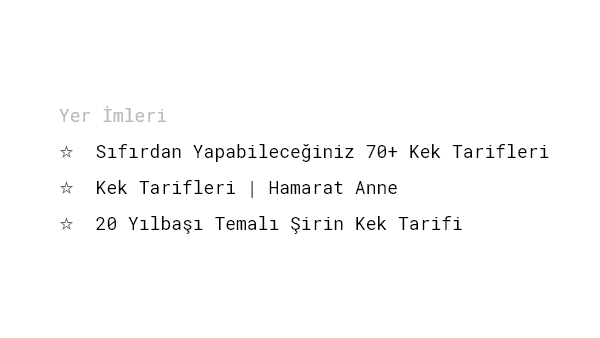

### İstek Listeleri ve Favoriler

Yer imleriyle benzer bir konsepte sahip olan favoriler özelliğini, çoğu uygulamada sıklıkla görebiliriz. Amazon ve Airbnb ise favori yerine "istek listesi demeyi tercih ediyor. Twitter favorilerinizi "Beğeniler" kısmında tutuyor, ve telefon rehberinizde kişilerinizi "Favoriler" kısmına ekleyebilirsiniz. Kullancılara yer imi özelliği vermeniz onların genel olarak platformla olan etkileşimini arttırır. Eklenen her favori ile [kullanıcı daha fazla kullanım taahahüt eder](/commitment-consistency/).

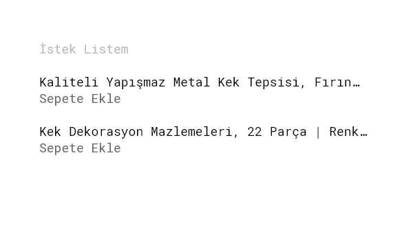

### Arama Önerileri

Otomatik tamamlama modeli bütün arama işlevleri için bir ortak payda haline geldi. Arama önerileri, kullanıcıları istedikleri sonuçlara yönlendirerek daha iyi bir sorgulama oluşturabilir. Aynı zamanda, sağlanan öneriler aramayla alakalı olduğunda insanları daha fazla araştırmaya teşvik edebilir.

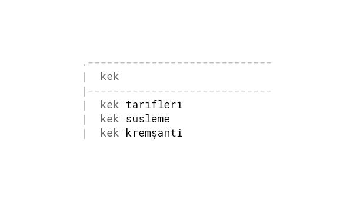

### Paid media

Everything from web banners to paid search marketing is used to acquire new customers, and falls within the category of paid triggers. It’s an effective way to expose your product’s name to a broad audience within a short time. Paid channels will continue to evolve with more features aimed at providing better audience targeting and, thus, better experiences for visitors. According to the research from [Ascend2](http://research.ascend2.com/2017-content-marketing-distribution-survey-summary-report/), 67% of the marketers interviewed said that search engine marketing is the most effective paid channel to distribute content, followed by social media ads with 50%.

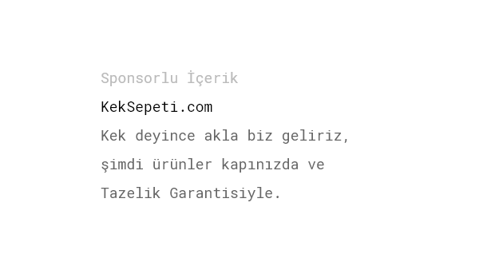

### Owned media
A high-quality, digital presence is critical to success. Owned media refers to the content you create and publish on channels that you own. That includes your main website, blogs, and newsletters, but also any social media presence, which all act as an extension of your brand. The more owned media you have, the more potential external triggers you have to provide to acquire new visitors. Owned media leads to earned media.

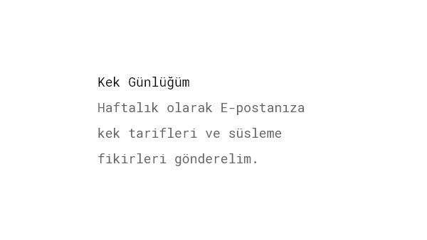

### Earned media
In contrast to paid media, which gets in front of people by payment, earned media refers to exposure you’ve gained through word-of-mouth. Earned media is the tweet that praises your service. It’s the blog post that mentions your product and got shared by thousands. Establish yourself and your business as the leader in your niche, which will give you a ton of [social proof](/social-proof/) and credibility. Not everybody will like your brand. By publicly acknowledging hate against your business, you will increase the positive word-of-mouth created by your brand lovers ([Monahan, Espinosa & Ortinau, 2017](https://www.researchgate.net/publication/314266211_Hate_Does_Not_Have_to_Hurt_The_Influence_of_Hate-Acknowledging_Advertising_on_Positive_Word_of_Mouth_An_Extended_Abstract)).

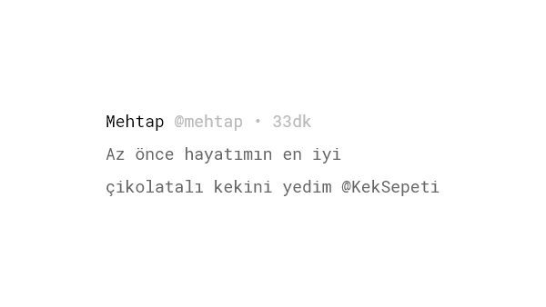

### Internal triggers
They happen all the time. Unlike the external triggers from the previous examples, you can’t see or hear an internal trigger. Internal triggers automatically manifest in your mind through the emotions, situations, places, and people around you. Negative emotions, especially, are powerful triggers. Just a spark of loneliness, boredom, or fear of missing out will make us check Facebook, Instagram, or Snapchat. Researchers find that people with depressive symptoms tend to [check their inboxes more often](http://www.nytimes.com/2012/06/17/opinion/sunday/how-depressed-people-use-the-internet.html?mcubz=3), which relates to high levels of anxiety. The Holy Grail is to convert external triggers to internal ones, bringing a user back again and again by attaching your product to their daily routines and emotions. Ask yourself in which situations might your users find themselves in when the desired habit could be built, and see if an external trigger can be fired closely to that moment.

